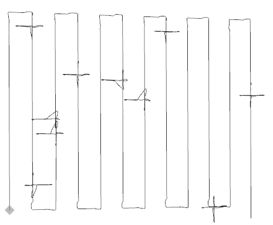
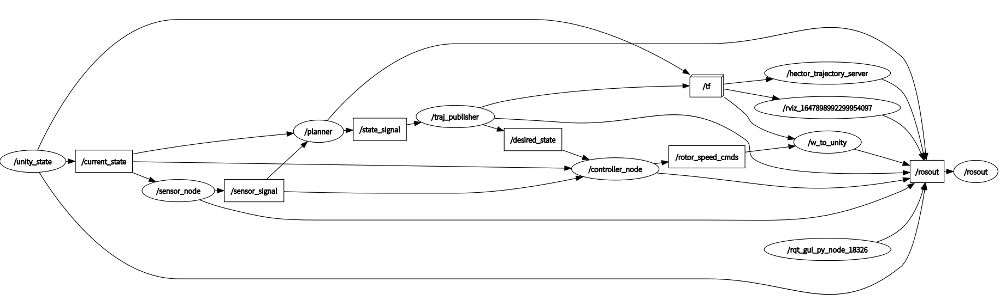

# Path Planning for UAV Avalanche Rescue
Here are the [slides](./docus/slides.pdf) and [report](./docus/report.pdf)

Group member: Dongyue Lu, Yunfeng Kang, Xuhui Zhang, Yamo Akrami, Yuhang Cai

We try four methods separately: Cross Flight, Iterative Cross Flight, Triangulation and Directed Iterative Local Search, we publish Cross Flight coded mainly by Dongyue Lu in this repository.


## Run dockerfile 

First, go to `docker` directory and build the image from a Dockerfile
```
sudo DOCKER_BUILDKIT=1 docker build -t cross_flight . --no-cache --ssh default=$SSH_AUTH_SOCK
```
And run it
```
sudo docker run -it -d --network=host --name cross_flight cross_flight:latest bash
```
### Starting and Interacting
Start the docker container
```
sudo docker start cross_flight
```

Open an interactive shell
```
sudo docker exec -it cross_flight bash
```

to exit the docker shell type `exit`

### Stopping and Deleting
stop the container:
```
sudo docker stop cross_flight
```
delete the container
```
sudo docker rm cross_flight
```

To visualize the trajectory, we have already installed  `hector_trajectory_server`

To run the project, open six terminals:

### Terminal 1: build and open the simulation environment on host

```
catkin build unity_bridge
source devel/setup.bash
roslaunch unity_bridge unity_sim.launch
```
### Terminal 2: run rviz on host

```
source devel/setup.bash
rosrun rviz rviz
```

### Terminal 3: run the control module in docker

```
source devel/setup.bash
roslaunch controller_pkg controller.launch
```

### Terminal 4: run the sensor model in docker

```
source devel/setup.bash
roslaunch sensor_model sensor.launch
```

### Terminal 5: run the trajectory generation module in docker

```
source devel/setup.bash
roslaunch basic_waypoint_pkg waypoint_mission.launch
```
### Terminal 6: run the visualization in docker

```
source devel/setup.bash
rosrun hector_trajectory_server hector_trajectory_server _target_frame_name:=world _source_frame_name:=av
```
then add path and odometry topic in rviz, the fixed frame should be av. A typical trajectory of cross flight will be like



You can also generate more victims by running the following command in docker
```
python ../random_victims.py
```
# Documentation
## Overview
An overview graph of all topics and nodes is shown in following


[Unity_state](./catkin_ws/src/unity_bridge/src/unity_state.cpp) publishes current state of the drone, After the [sensor_node](./catkin_ws/src/sensor_model/src/sensor_node.cpp) receives it, it calculates the output signal, publishes it to the [planner](./catkin_ws/src/basic_waypoint_pkg/src/planner.cc), the [planner](./catkin_ws/src/basic_waypoint_pkg/src/planner.cc) plans the path, and publishes the waypoint in the path to the [traj_publisher](./catkin_ws/src/unity_bridge/src/traj_publisher.cpp). The [traj_publisher](./catkin_ws/src/unity_bridge/src/traj_publisher.cpp) converts the path to the desired state and publishes it to the [controller_node](./catkin_ws/src/controller_pkg/src/controller_node.cpp), and the  [controller_node](./catkin_ws/src/controller_pkg/src/controller_node.cpp) outputs the control signal to the simulation environment.


## [Sensor_node](./catkin_ws/src/sensor_model/src/sensor_node.cpp)
Coded by Dongyue Lu and Yamo Akrami, simulates the performance of an avalanche transceiver. Some important functions:

`computeLoop()` generates a intensity signal based on the victim's distance from the drone, and adds noise

`addNoise()` returns Gaussian or exponential noise


## [Planner](./catkin_ws/src/basic_waypoint_pkg/src/planner.cc)
### Cross Flight
Coded by Dongyue Lu, implements cross flight local search method.
Some important functions:

`reachgoal()` Iteratively brings the drone to the goal position

`potentialField()` implements potential field path planner

`display_victims()` displays the victim's location, the error and time

`localsearch()` implements cross flight local search

`globalsearch()` implements grid global search

`max_signal_index()` masks the victim's signal found and returns the largest signal's index among the remaining signals

`publishState()` publishes the start, end position and speed of the trajectory to [traj_publisher](./catkin_ws/src/unity_bridge/src/traj_publisher.cpp) 

### Triangulation
Coded by Xuhui Zhang

Localize victims with triangulation: Record marginal points where signals appear or disappear in S-shape flight. Victims are identified and signals are assigned to each victim. Signal assignment is verified, wrong assignment is removed and overlapping is handled. Calculate each victim's position.
Verify localization and rescue victims. Some important functions:

`triangulation_search()` execute global search and record marginal points

`average_y()` calculate average y-coordinates of all combinations of marginal points

`signals_assignment()` assign marginal points to each victim according to average y-coordinate

`assignment_verification()` check distance and verify if the assignment is correct to avoid overlapping

`localize_victims()` calculate the position of each victim

`rearrange_order()` reorder found victims according to distance to drone's current position

`verification_rescue` fly to each victim, output the maximal signal intensity, verify if the localization is correct and rescue the victim

`evaluation()` evaluate results, give absolute error and output signal intensities at each position

### Iterative Cross Flight
Coded by Yunfeng Kang, theoretical design of cross flight and iterative cross flight, implementation of iterative cross flight. 
Some important functions:

`display_victims()` displays the victim's location, the error and time

`localsearch()` implements iterative cross flight local search

`globalsearch()` implements grid global search

### Iterative Local Search
Coded by Yamo Akrami
#### Directed Iterative Local Search (in directed-iterative-local-search branch)

`display_victims()` displays the victim's location, the error and time

`localsearch()` implements directed iterative local search

`directedILS()` implements update step of directed iterative local search

`globalsearch()` implements grid global search

#### Undirected Iterative Local Search (in undirected-iterative-local-search branch)

`display_victims()` displays the victim's location, the error and time

`localsearch()` implements undirected iterative local search

`undirectedILS()` implements update step of undirected iterative local search

`globalsearch()` implements iterative grid global search

## [Traj_publisher](./catkin_ws/src/unity_bridge/src/traj_publisher.cpp)
Coded by Dongyue Lu, calculates the desired state of the drone at each time through the starting point, ending point and speed of the straight path, and publishes it to the controller

## [Controller](./catkin_ws/src/controller_pkg/src/controller_node.cpp)
Coded by Dongyue Lu, implements the geometric tracking controller like previous labs. After receiving the desired state and current state, calculates thrust and torque to control the drone, and publishes the propeller speeds to the simulation environment

## Others
[random_victims](./random_victims.py)

Coded by Dongyue Lu, generates waypoint coordinates of avalanche scenario, randomly generates victim coordinates and writes to configuration file


